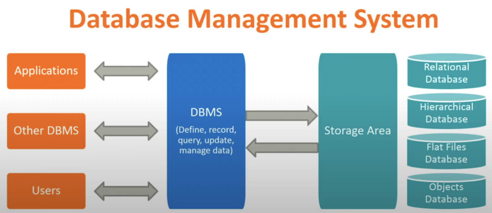
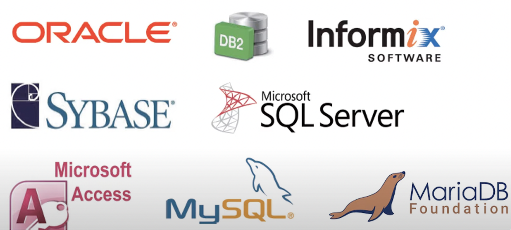

# Lesson 1. 데이터베이스 개요

## 1. 개념
- 방대한 데이터를 효율적으로 관리하기 위해 컴퓨터에 통합, 저장한 것
- 특정 조직의 여러 사용자가 **공유**하여 사용할 수 있도록 **통합**해 **저장**한 **운영** 데이터의 집합
    - 데이터베이스에 저장된 데이터의 특징
        - 공유: 특정 조직의 여러 사용자가 함께 소유 & 이용 가능한 공유 데이터
        - 통합: 최소의 중복과 통제 가능한 중복만 허용
        - 저장: 컴퓨터가 접근할 수 있는 매체에 저장, ex. 하드디스크, SSD  등
        - 운영: 조직의 주요 기능을 수행하기 위해 지속적으로 필요
- 데이터베이스 관리 시스템(DBMS)를 통해 관리

## 2. 데이터베이스 특징
- 실시간 접근: 사용자의 요청에 실시간 응답
- 계속 변화: 데이터의 지속적인 삽입, 삭제, 수정을 통해 정확한 데이터 유지
- 동시 공유: 서로 다른 데이터의 동시 사용 & 같은 데이터 동시 사용 모두 가능
- 내용 기반 참조: 데이터 저장 위치가 아닌 내용으로 참조, ex. 컬럼1의 값 > 100

## 3. 파일처리시스템 vs DBMS
- 파일처리시스템: 데이터를 **파일**로 관리하기 위해 파일을 생성, 삭제, 수정, 검색 기능을 제공하는 소프트웨어, 응용프로그램마다 필요 데이터를 별도 파일로 저장
 

 
    |
파일처리 시스템의 단점
|
DBMS의 파일처리시스템 단점 보완
|
    |:----|:----|
    |- 데이터 중복성: 여러 파일에 중복 저장... 일관성X, 무결성X|- 데이터 중복X, 불일치 감소,   무결성 향상, 표준화 용이|
    |- 데이터 종속성: 파일구조 변경시 응용프로그램도 변경해야 함|- 데이터 독립성|
    |- 동시공유, 보안, 회복 부족|- 데이터 공유, 동시접속 가능  - 보안 향상(데이터 접근 관리 통제 가능)  - 시스템고장으로부터 DB 복구 가능|
    |- 응용 프로그램 개발 어려움:  파일 처리까지 일부 개발 필요|- 응용프로그램 개발 비용 감소|
    ||- 요구사항에 따른 조정 가능, ex. 속성값 추가, 불필요한 것 삭제  - 데이터 중심의 중앙 집중 관리|

- 파일시스템의 경우 응용프로그램이 데이터 파일에 직접 접근, DBMS는 Stoarage Area를 별도 구분하므로 파일처리 신경쓰지 않고 응용프로그램 개발에 집중 가능

- DBMS 종류
 

 

## 4. DBMS 주요기능
- 정의 기능(DDL, Data Definition Language)
    - DB 구조 정의, 수정 가능
    - DB 저장 구조, 접근 방법, 데이터 형식 등 정의
    - *CREATE, ALTER, DROP, TRUNCATE*
- 조작 기능(DML, Data Manipulation Language)
    - 데이터 삽입, 삭제, 수정, 검색
    - *SELECT, INSERT, UPDATE, DELETE*
- 제어 기능(DCL, Data Control Language)
    - 데이터를 정확, 안전하게 유지
    - DB 무결성 유지, 시스템 장애로부터 복구, 병행 수행 제어 
    - *GRANT, REVOKE, COMMIT, ROLLBACK*

## 5. 데이터베이스 사용자
- 응용 프로그래머: 프로그래밍 언어를 사용해 응용 프로그램이나 인터페이스를 구현하는 사람
- 최종 사용자: 데이터 검색, 삽입, 삭제, 갱신하기 위해 DBMS 사용하는 사람(end user)
- DB 관리자: DDL, DCL을 사용해 DB 스키마 생성, 관리하는 사람   
