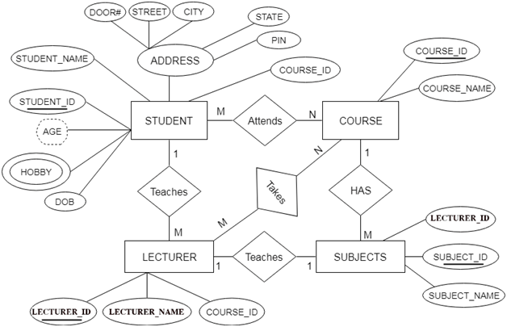
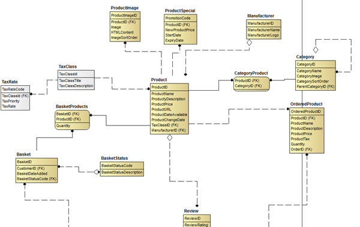
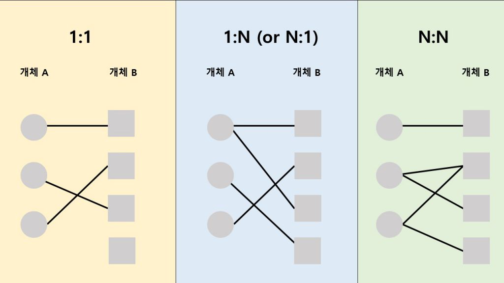
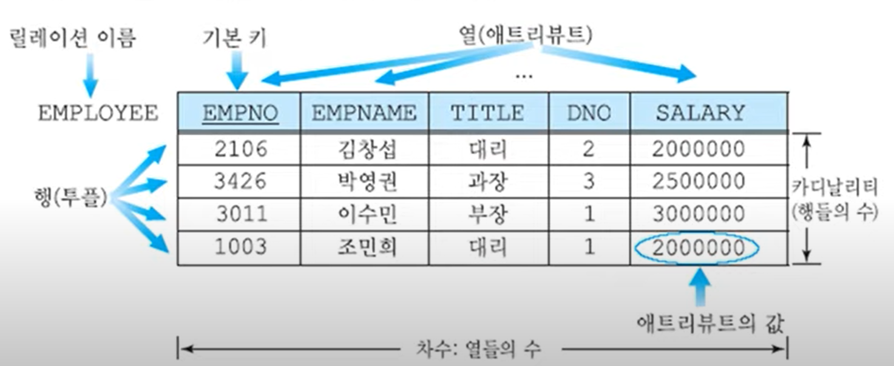
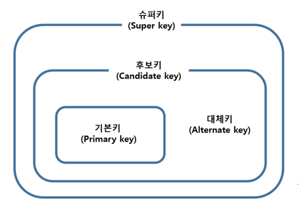

# Lesson 2. 데이터 모델링

## 1. 개념
- 현실 세계에 존재하는 데이터를 <u>컴퓨터 세계의 데이터베이스로 옮기는 변환 과정</u>
- 데이터베이스 설계의 핵심 과정

 

> ### 1) 개념적 데이터 모델
- *사람의 머리로 이해할 수 있도록* 현실 세계를 개념적 모델링하여 데이터베이스의 개념적 구조로 표현하는 도구
- *예) 개체-관계 모델*

 

> ### 2) 논리적 데이터 모델
- 개념적 구조를 논리적 모델링하여 데이터베이스의 논리적 구조로 표현하는 도구
- *예) 관계 데이터 모델*

---

## 2. 개체-관계 모델 
*(E-R model; Entity-Relationship model)*
### 2.1 개체-관계 모델 개념 
- 개체와 개체 간의 관계를 이용해 현실 세계를 개념적 구조로 표현
- 핵심 요소 : **개체**(*Entity*), **속성**(*Attributes*), **관계**(*Relationship*)
    - *예) 크루원(Entity)는 이름, 나이, 생일 등의 속성(attributes) 값으로 구성된 Entity 이다.*

- 개체-관계 다이어그램(**ERD**; E-R diagram)   : 개체-관계 모델을 이용해 현실 세계를 개념적으로 모델링한 결과물을 그림으로 표현한 것

<table>

*ERD 예시*
 <tr>
    <td>

</td>
    <td>

</td>
 </tr>
</table>

### 2.2 개체 (Entity)

|  요소           |
   특징   
|
|:--------------:|:------------|
|  **개체**   (*Entity*)  | - 현실 세계에서 사람이나 사물과 같이 구별되는 것   - <U>저장할 가치가 있는 중요 데이터</U>를 가지고 있는 사람이나 사물 개념, 사건 등   - <U>다른 개체와 구별되는 이름을 가지고 있고, 각 개체만의 고유한 특성이나 상태</u>, 즉 속성을 하나 이상 가지고 있음 |
| **속성**   (*Attribute*) | - <U>개체나 관계가 가지고 있는 고유의 특성</U>   - 의미 있는 데이터의 <U>가장 작은 논리적 단위</U>   - 파일 구조의 field와 대응됨   - ERD에서 타원으로 표현, 타원 안에 이름 표기 |
| **개체 타입**   (*Entity Type*) | - 개체를 고유의 이름과 속성들로 정의한 것   - 파일 구조의 record type에 대응됨 |
| **개체 인스턴스**   (*Entity Instance*) | - 개체를 구성하고 있는 속성이 실제 값을 가짐으로써 <u>실체화된 개체</u>   - Entity Occurrence 라고도 함   - 파일 구조의 Record Instance에 대응됨 |
| **개체 집합**   (*Entity Set*) | - 특정 개체 타입에 대한 개체 인스턴스를 모아놓은 것 |

*참고) record : 행 , field : 열, 컬럼을 의미함*

 

### 2.3 속성 (Attribute)

> ### 1) **속성의 분류**

| 분류 기준 | 속성 유형 |
 정의 
|
|:----:|:---:|---------------|
| 속성 값의 개수 | **단일 값 속성**   (single-valued attribute)| 값을 하나만 가질 수 있는 속성  (*이름, 나이*)|
|| **다중 값 속성**   (multi-valued attribute) | 값을 여러 개 가질 수 있는 속성  (*연락처*)|
|의미의 분해 가능성 | **단순 속성**   (simple attribute) | 의미를 더는 분해할 수 없는 속성  (*ISBN, 가격*)|
|| **복합 속성**   (composite attribute) | 의미를 분해할 수 있는 속성  (*주소, 생년월일*)|
| 기존 속성 값에서 유도 | **유도 속성**   (derived attribute)| 기존의 다른 속성의 값에서 유도되어 결정되는 속성  (*평균, 합계*)| 

 

> ### 2) **속성의 종류**

- **널 속성** (null attribute) : 널 값이 허용되는 속성
    - **Null 값** : 아직 결정되지 않았거나 모르는 값 또는 존재하지 않는 값,   공백이나 0과는 의미가 다름
- **키 속성** (key attribute)
    - 각 개체 인스턴스를 식별하는데 사용되는 속성
    - 모든 개체 인스턴스의 키 속성 값이 다름
    - 둘 이상의 속성들로 구성되기도 함

 

### 2.4 관계 (Relationship)

- 개체와 개체가 맺고 있는 의미 있는 연관성
- 개체 집합들 사이의 대응 관계, 즉 <u>매핑(mapping)을 의미</u>
- 관계의 유형 : 관계에 참여하는 개체 타입의 수 기준

| 관계 유형 |개체 A의 각 개체 인스턴스 &rarr; 개체 B의 개체 인스턴스 |개체 B의 각 개체 인스턴스 &rarr; 개체 A의 개체 인스턴스|
|:--------:|:-----------:|:-------------:|
| **일대일(1:1) 관계** | 하나와 관계를 맺을 수 있음 |하나와 관계를 맺을 수 있음|
| **일대다(1:n) 관계** | 여러 개와 관계를 맺을 수 있음 | 하나와 관계를 맺을 수 있음|
| **다대다(n:m) 관계** | 여러 개와 관계를 맺을 수 있음 | 여러 개와 관계를 맺을 수 있음|

---

## 3. 관계 데이터 모델

### 3.1 관계 데이터 모델의 개념
- 개념적 구조를 논리적 구조로 표현하는 논리적 데이터 모델
- <u>하나의 개체에 대한 데이터를 하나의 릴레이션에 저장</u>

 

### 3.2 관계 데이터 모델 용어
| 용어 |
 정의 
|
|:------:|---------------------|
| **릴레이션**   (Relation) | - 하나의 개체에 관한 데이터를 2차원 테이블의 구조로 저장한 것   - 파일 관리 시스템 관점에서 파일(file)에 대응 |
| **속성**   (Attribute) | - 릴레이션의 열, 애트리뷰트   파일 관리 시스템 관점에서 field에 대응 |
| **튜플**   (Tuple) | - 릴레이션의 행   - 파일 관리 시스템 관점에서 Record 에 대응 |
| **도메인**   (Domain) | - 하나의 속성이 가질 수 있는 모든 값의 집합   - 속성 값을 입력 및 수정할 때 적합성 판단의 기준이 됨   - 일반적으로 속성의 특성을 고려한 데이터 타입으로 정의 |
| **Null** | - 속성 값을 아직 모르거나 해당되는 값이 없음을 표현 |
| **차수**   (Degree) | - 하나의 릴레이션에 속성의 전체 개수 |
| **카디널리티**   (Cardicality) | - 하나의 릴레이션에 튜플의 전체 개수 |

 

*참고*)

|| 파일 관리 시스템 | 개체-관계 모델 | 관계 데이터 모델 |
|:----:|:------:|:-----:|:-----:|
| 행 | Record | 정확한 대응 용어 X   (*Entity type, instance*) | Tuple |
| 열 | Field | Attribute | Attribute |

 

### 3.3 릴레이션

> ### 1) **릴레이션 구성**
- **릴레이션 스키마** (Relation Schema)
    - 릴레이션의 논리적 구조
    - <u>릴레이션의 이름과 릴레이션에 포함된 모든 속성 이름으로 정의</u>   *예) 고객(고객ID, 고객 이름, 나이, 등급, 직업, 적립금)*
    - 릴레이션 내포(Relation Intension) 이라고도 함
    - 정적인 특징이 있음
- **릴레이션 인스턴스** (Relation Instance)
    - <u>어느 한 시점에 릴레이션에 존재하는 튜플들의 집합</u>
    - 릴레이션 외연 (Relation Extension) 이라고도 함
    - 동적인 특징이 있음

*참고) 데이터베이스 구성*
- ***데이터베이스 스키마** (Database Schema)*
    - *<u>데이터베이스의 전체 구조</u>*
    - *데이터베이스를 구성하는 릴레이션 스키마의 모음*
- ***데이터베이스 인스턴스** (Database Instance)*
    - *데이터베이스를 구성하는 릴레이션 인스턴스의 모음*

> ### 2) **릴레이션 특성**

| 특성 | |
|:----:|-----|
| **튜플의 유일성** | - 하나의 릴레이션에는 동일한 튜플이 존재할 수 없음|
| **튜플의 무순서** | - 하나의 릴레이션에서 튜플 사이의 순서는 무의미 |
| **속성의 무순서** | - 하나의 릴레이션에서 속성 사이의 순서는 무의미|
| **속성의 원자성** | - 속성 값으로 원자 값만 사용할 수 있음|

*참고)   원자성 : 한 트랜잭션(=여러 개의 작업을 하나로 묶은 실행 유닛)의 연산들이 모두 성공하거나, 반대로 전부 실패되는 성질*

 

### 3.4 키 (Key)
- 릴레이션에서 튜플들을 유일하게 구별하는 속성 또는 속성들의 집합

> ### 1) **키 특성**

| 특성 | |
|:----:|-----|
| **유일성**   (Uniqueness) | - 하나의 릴레이션에서 모든 튜플은 서로 다른 키 값을 가져야 함|
| **최소성**   (Minimality) | - 꼭 필요한 최소한의 속성들로만 키를 구성함 |

 

> ### 2) **키 종류**

| 키 종류 |
 특성 
| 예시(*고객 릴레이션*) |
|:-------:|------------|:-----------------------------:|
| **슈퍼키**   (Super Key) | - **유일성**을 만족하는 속성 또는 속성들의 집합 | *고객아이디, (고객아이디, 고객이름), (고객이름, 주소) 등*|
| **후보키**   (Candidate Key) | - **유일성과 최소성**을 만족하는 속성 또는 속성들의 집합 | *고객아이디, (고객이름, 주소) 등*|
| **기본키**   (Primary Key) | - 후보키 중에서 기본적으로 사용하기 위해 선택한 키 | *고객아이디*|
| **대체키**   (Alternate Key) | - 기본키로 선택되지 못한 후보 키| *(고객이름, 주소)*|
| **외래키**   (Foreign Key) | - 다른 릴레이션의 기본키를 참조하는 속성 또는 속성들의 집합   - 릴레이션들 간의 관계를 표현 ||

 

 

### 3.5 무결성 제약 조건 (Integrity Constraint)
- **무결성 제약 조건**(Integrity Constraint)
    - 데이터의 무결성을 보장하고 일관된 상태를 유지하기 위한 규칙
    - **무결성** : 데이터 결함이 없는 상태, 즉 <u>정확하고 유효하게 유지하는 것</u>
- **개체 무결성 제약조건** (Entity Integrity Constraint)
    - <u>기본키</u>를 구성하는 모든 속성은 <u>널 값을 가질 수 없는 규칙</u>
- **참조 무결성 제약조건** (Referential Integrity Constraint)
    - <u>외래키는 참조할 수 없는 값을 가질 수 없는 규칙</u>