# Lesson 3. 관계 데이터 연산

> ## 정의
### 관계 모델
-  first-order predicate logic을 갖춘 구조와 언어를 통해 데이터를 다루는 것(<a href = "https://en.wikipedia.org/wiki/Relational_model">위키피디아</a>)
    -  first-order predicate logic: 술어 논리 - 기호를 통해 논리를 서술
### 관계 데이터 연산(relational data operation)
- 원하는 데이터를 얻기 위해 relation에 필요한 처리 수행

  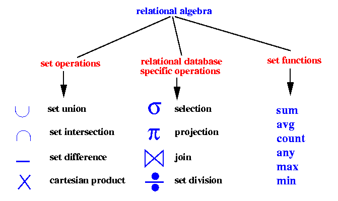
  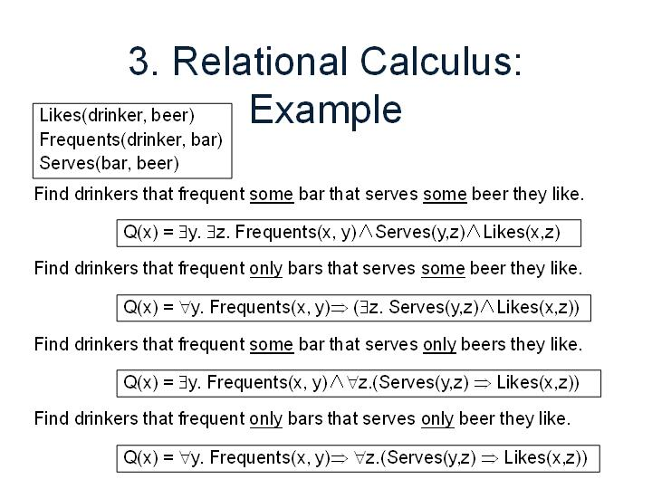
  <figcaption align="center">그림1. 관계대수와 관계 그림</figcaption>

<table>
    <thead>
        <tr>
            <th></th>
            <th>관계대수</th>
            <th>관계해석</th>
        </tr>
    </thead>
    <tbody>
    <tr>
      <td>정의</td>
      <td>원하는 결과를 얻기 위해 데이터의 처리 과정을 순서대로 기술</td>
      <td>원하는 결과를 얻기 위해 원하는 데이터가 무엇인지 기술
      </td>
    </tr>
    <tr>
    <td>역할</td>
    <td colspan=2>
    - 데이터 언어의 유용성 검증 기준   - "완전하다"(relationally compelte): 관계 대수나 해석으로 기술할 수 있는 모든 질의(query)가 가능한 데이터 언어  
    </td>
    </tr>
    </tbody>
</table>

> ## I. 관계대수
- 절차 언어: 원하는 결과를 얻기 위해 릴레이션의 처리과정을 **순서대로** 기술하는 언어
- 릴레이션 처리 연산자: 집합/관계 연산자
- 폐쇄 특성: 연산대상, 연산 결과 모두 릴레이션

### 관계 대수 연산자
|집삽 연산자(set operation)|관계 연산자(relational operaition)|
|:---:|:---:|
|합집합, 교집합, 차집합, 카티션 프로덕트|셀렉트, 프로젝트, 조인, 디비전|

> ### 1. 집합연산자
  - 피연산자 2개 필요
  - 합병 가능 조건
    - 두 릴레이션의 차수 같아야 함
    - 두 릴레이션의 속성 도메인이 같아야 함
  - 카티션 프로덕트(cartesian product): 두 릴레이션의 모든 연결을 통해 만들 수 있는 튜플
  
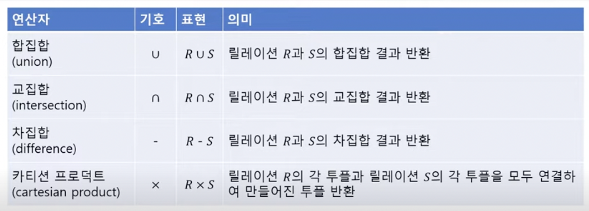

  
  |집합종류|특징|예제|
  |:---|:---|:--:|
  |합집합|- 합병 가능한 두 릴레이션의 합집합   - 둘 중하나의 릴레이션에 속하는 모든 튜플 반환   - 두 릴레이션의 차수와 같음   - 카디널리티 릴레이션 $\leq$ R과 S 카디널리티 합   - 교환 특징 $R \cup S$ = $S \cup R$   - 결합 특징: $(R \cup S)\cup T = R \cup (S\cup T) $|
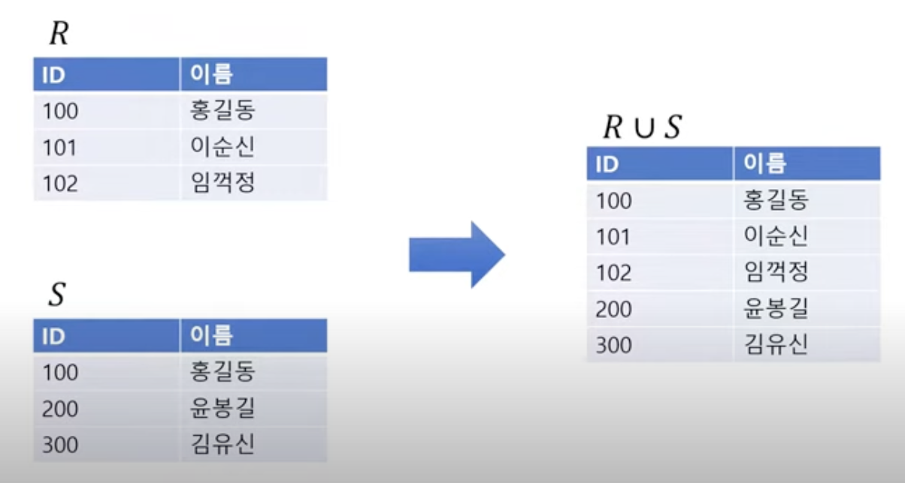
|
  |교집합|- 합병 가능한 두 릴레이션   - R, S 릴레이션에 공통으로 속하는 튜플   - 릴레이션 차주 같음   - 카디널리티 릴레이션 R, S $ \leq $ 어떤 카디널리티   교환적 측징/결합적 특징|
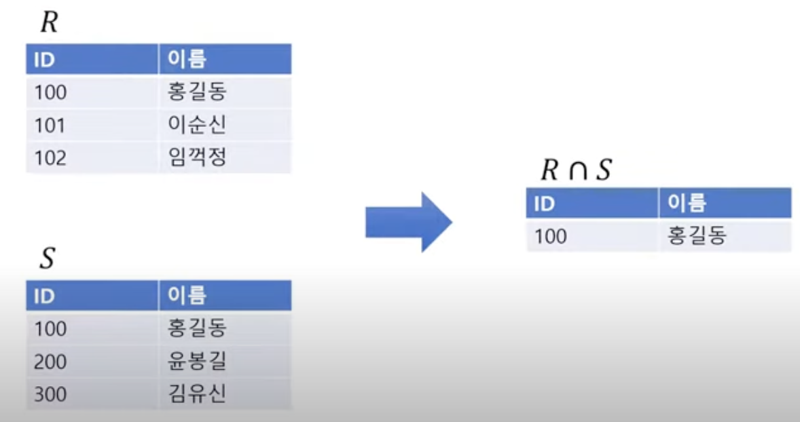
|
  |차집합|- 합병 가능한 R,S 두 릴레이션의 차집합(R-S)  - R에는 존재, S에는 없는 튜플 결과   - 특성1. R, S 차수 같음   -특성2. R-S 릴레이션의 (카디널리티)차집합 $ \leq $ 릴레이션 R 카디널리티  - 교환, 결합 특징 X|
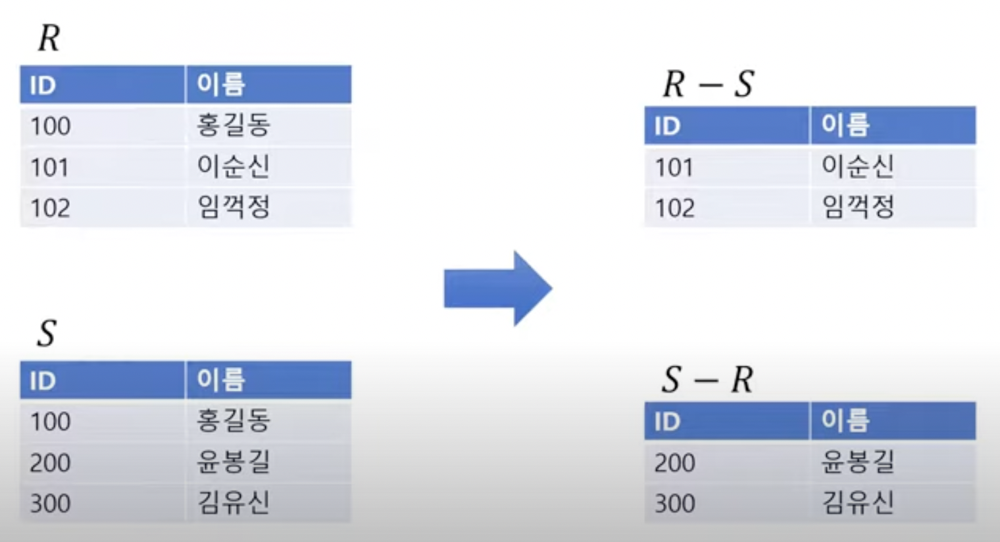
|
  |카티션 프로덕트|- R x S   - R과 S 모두 연결   - 차수 = R, S 차수 합   - 카디널리티 = R, S 카디널리티 곱   - 교환(RxS=SxR), 결합( (RxS)xT =Rx(SxT)) 특징 가짐|
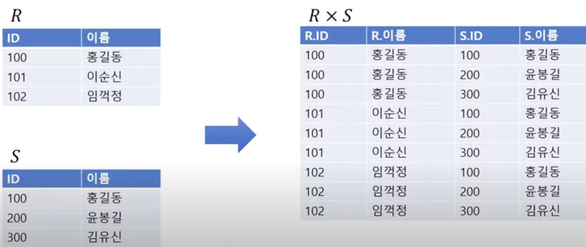
|

> ### 2. 관계 연산자
  
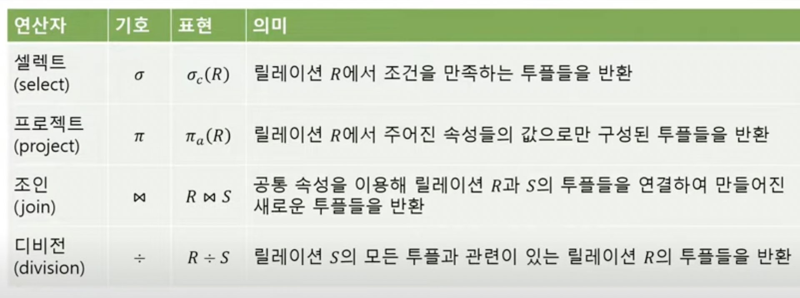

 
 - 각 연산 기호 숙지할 것
    - 셀렉트: $c$ 조건, $R$ 릴레이션 $\rightarrow$ 조건 $c$를 만족하는 튜플
    - 프로젝트: $a$ 속성들의 리스트, 주어진 속성을 만족하는 튜플

|연산자|특징|예제|
|:---|:---|:---:|
|셀렉트|- 조건 만족하는 튜플만 선택   - 하나의 릴레이션 대상으로 연산   - 표현식: where   - 조건식:   (a) a.k.a. 비교식(predicate)  (b) 속성과 상수의 비교 or 속성 간 비교   (c) - 비교연산자($\neq, \geq, <$ 등) or 논리연산자($\vee, \wedge $) 사용|
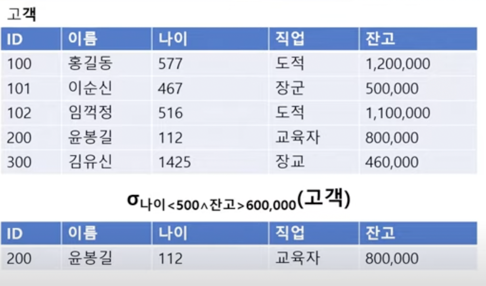
 
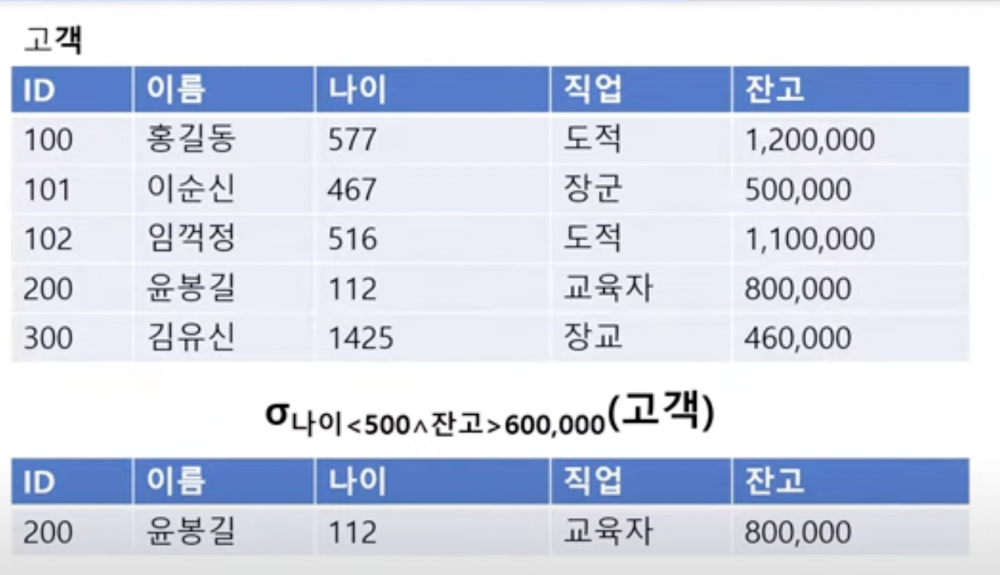
|
|프로젝트|- 릴레이션에서 선택한 속성의 값으로 결과 릴레이션 구성   - 하나의 릴레이션 대상 연산   - 표현식: 릴레이션[속성리스트]|
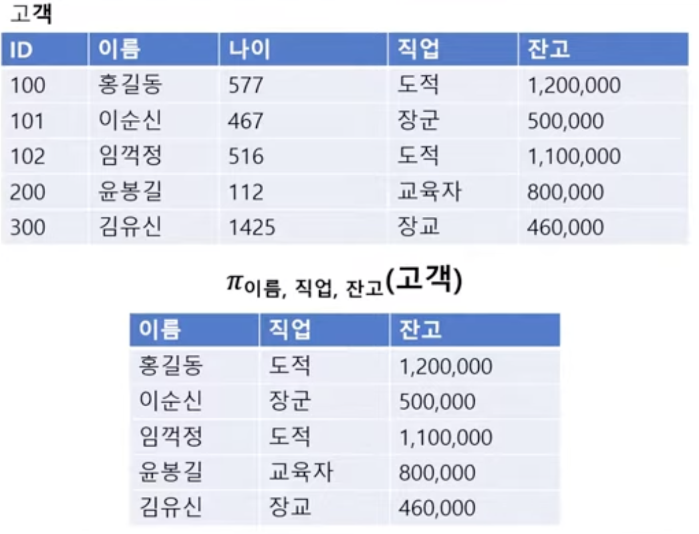|
|조인|- 두 릴레이션 결과 조합   - 조인 속성 값이 같은 튜플만 연결해 생성   - 두 릴레이션 공통 속성   - a.k.a 자연조인(natural join)|
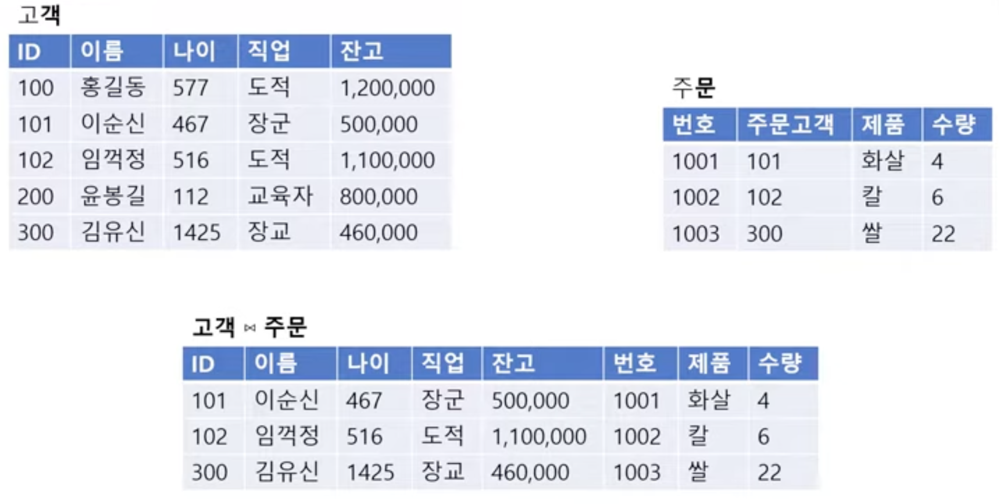|
|세타($\theta$)조인|- 자연 조인에 비해 일반화된 조인   - 조인 조건 만족하는 두 릴레이션의 모든 튜플 연결   - 차수 = 두 릴레이션 차수 합   - 릴레이션1 $\bowtie A \theta B $ 릴레이션2   - $\theta$는 비교연산자($\neq, \geq, <$ 등) 의미   - 동일 조인: $\theta$가 "="인 경우||
|디비전|- 릴레이션2의 모든 튜플과 관련 있는 릴레이션1의 튜플   - 단, 릴레이션1이 릴레이션2의 모든 속성 가짐 $\rightarrow$ 도메인이 같아야 함|
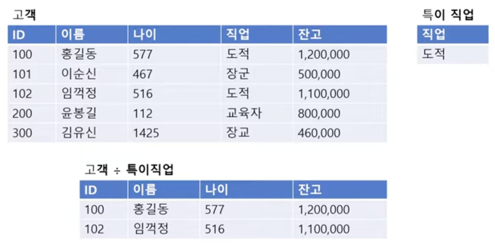
|
|**세미조인**|- 조인 속성으로 프로젝트 연산을 수행한 릴레이션을 이용하는 조인   - 릴레이션2를 조인속성으로 프로젝트 연산 $\rightarrow$ 릴레이션1에 자연조인   - 불필요한 속성을 미리 제거해 비용 감소   - 교환 특성 X  |- "주문" 릴레이션 내 주문 속성만 select 후 "고객" 릴레이션과 natural join 
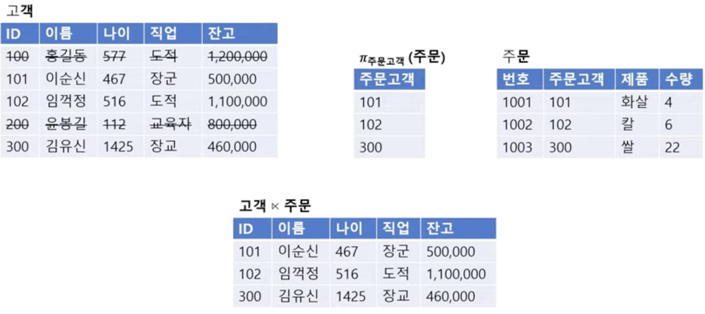
| 
|외부조인(outer join)|- 자연 조인 연산에서 제외되는 튜플도 결과에 포함   - 두 릴레이션 내 모든 튜플 포함   표현: 릴레이션1 $\bowtie +$ 릴레이션2 | 
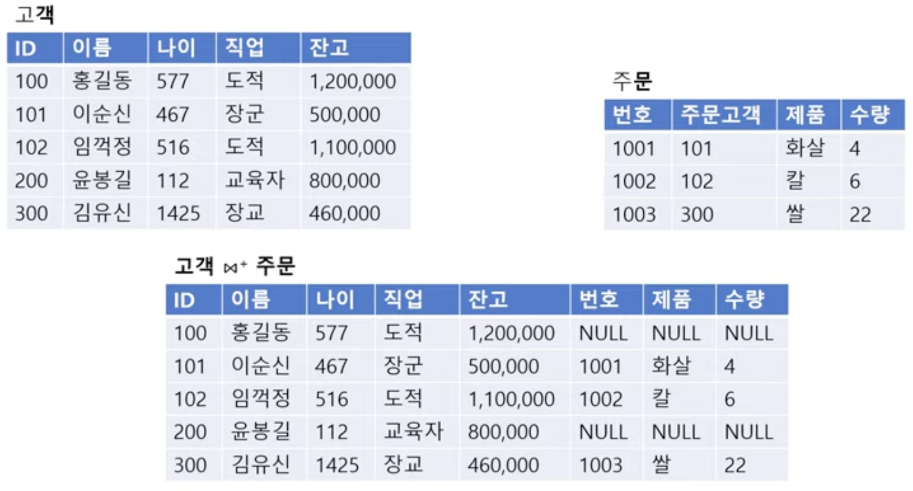
|

> ### 예제
|예제 상황|결과|
|:---|:---:|
|- 직업이 도적(select)인 고객에 한해 이름, 직업, 잔고 속성을 가져옴(project)|
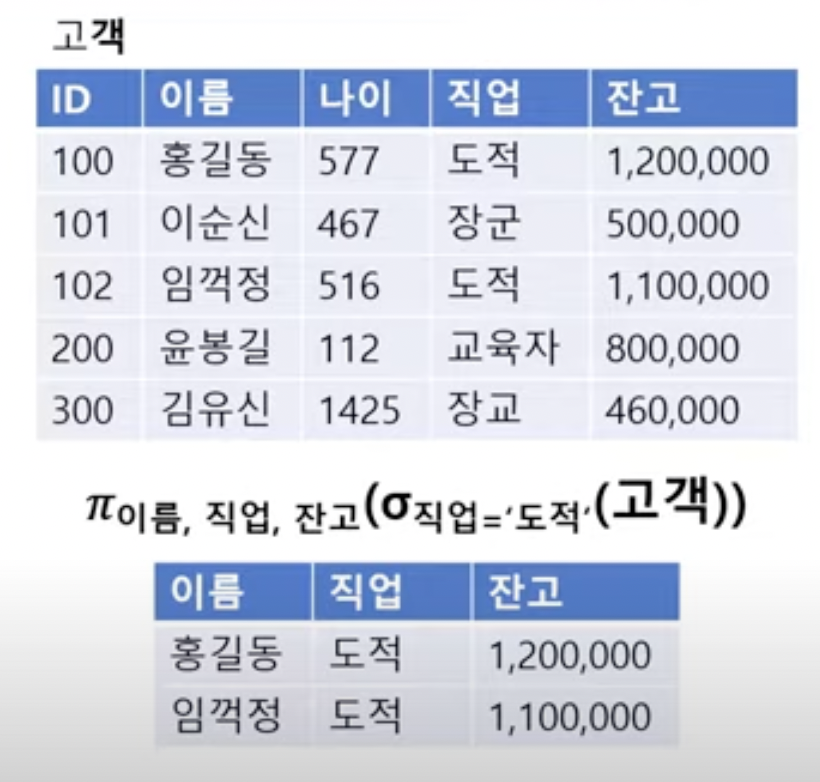
|
|- 고객과 주문을 조인하고 그 중 도적(select)인 고객에 한해 이름, 직업, 제품, 수량 속성을 가져옴(project)|
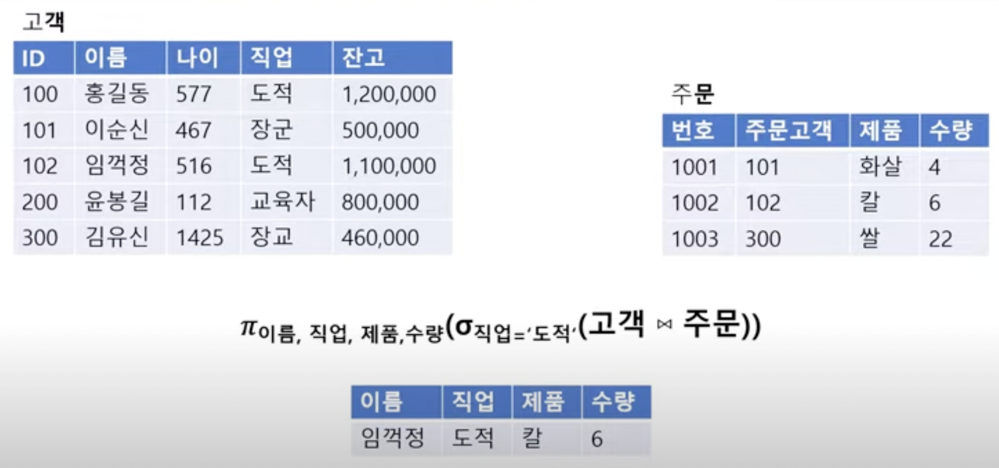
|
|- 고객 릴레이션에서 잔고가 100만원 이하인 사람(select, - 이순신, 윤봉길, 김유신)을 기존 고객 릴레이션에서 제외(차집합)|
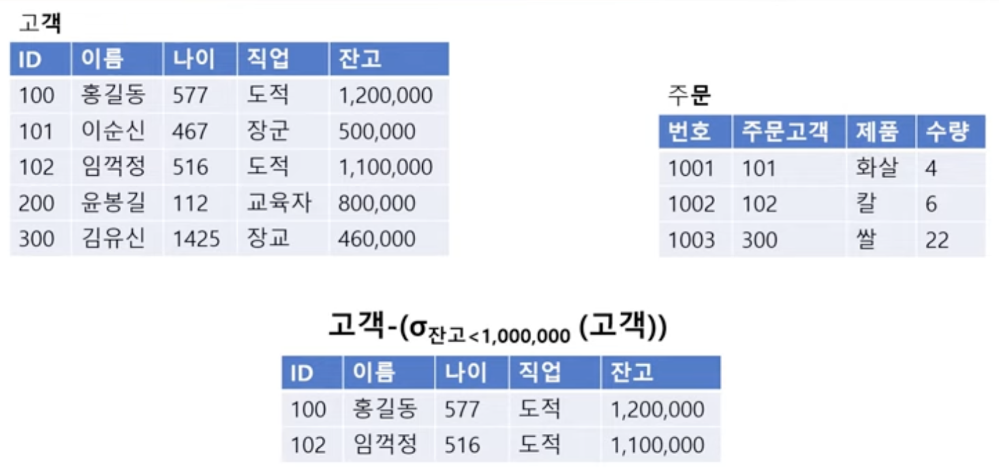
|

> ## II. 관계해석
- 비절차적 언어(nonprocedural langauge): 처리를 원하는 데이터가 무엇인지만 기술
- 수학의 프레디킷 해석에 기반(predicate: 주술관계를 표현하는 논리 체계, 술어논리)
- 분류
  - 튜플 관계 해석
  - 도메인 관계 해석