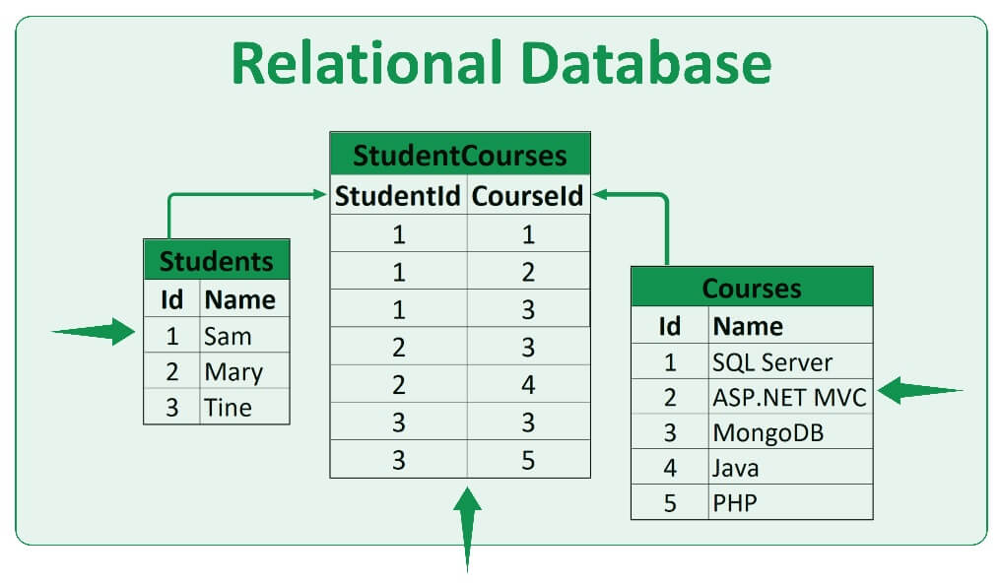
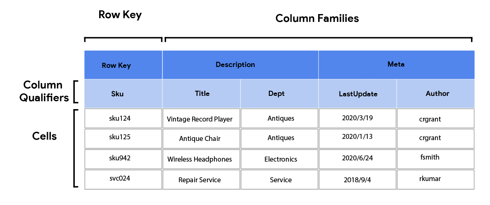

# Lesson 4. 발전과 종류

[I. 세대별 주요 데이터 베이스 종류](#i-세대별-주요-데이터-베이스-종류) 
- [1세대](#1세대)
- [2세대](#2세대)
- [3세대](#3세대)
- [4세대](#4세대) - [NoSQL](#nosql-종류)

[II. 분산 데이터베이스](#ii-분산-데이터베이스) 
[III. 데이터 웨어하우스](#iii-데이터-웨어하우스) 
[IV. 모바일 데이터베이스](#iv-모바일-데이터베이스)

# I. 세대별 주요 데이터 베이스 종류

 

그림1.  DBMS의 발전

> ## 1세대

1. 계층 DBMS
    - 데이터베이스를 트리 형태로 구성
    - IMS(Information Management System) 
2. 네트워크 DBMS
    - 데이터베이스를 그래프 형태로 구성
    - ex. IDS(Integrated Data Store)

> ## 2세대

1. 관계 DBMS
    - 데이터베이스를 테이블 형태로 구성
    - ex. 오라클, MS SQL 서버, 엑세스, 인포믹스, MySQL

> ## 3세대

1. 객체지향 DBMS
    - 객체를 이용해 데이터 베이스 구성
    - 예. O2, 온투스, 젬스톤
    - 객체 DBMS + 관계 DBMS

> ## 4세대

||2세대: 관계 DBMS| 4세대: NoSQL|
|:---|:---|:---|
|데이터 종류|정형 데이터|정형, 반정형, 비정형 데이터|
|대용량 데이터|대용량 처리 성능 저하| 대용량 처리 지원|
|스키마|사전에 정해진 스키마|스키마 없거나 변경 자유로윰|
|트랜잭션|지원, 일관성 유지| 지원 안함, 일관성 보장 어려움|
|검색기능| 조인 등 복잡한 검색 가능|단순한 검색 가능|
|확장성|클러스터 환경에 부적합|클러스터 환경에 적합|
|라이센스| 비용 지불| 오픈 소스|
|예|Oracle, MySQL, My SQL server|Cassandra, MongoDB, HBase|

1. NoSQL DBMS
    - 비정형 데이터 처리에 적합, 확장성이 뛰어남  (데이터 구조를 미리 정하지 않는 유연성)
    - 안정성, 일관성 유지를 위한 기능 포기
        - ACID를 포기한 대신 저렴한 비용으로 여러 대 컴퓨터에 분산, 저장, 처리 가능
    - 확장성이 뛰어나 여러 서버 컴퓨터에 데이터 분산해 저장, 처리에 주로 사용
    - 예. Mongo DB, HBase, Cassandra, Redis, Neo4j, OrientDB

- NoSQL: 관계 데이터베이스의 대안
    - 관계 DB는 정형화된 데이터 처리에 특화, 다양한 유형의 비정형 데이터 처리에는 적합하지 않음
    - 단일 컴퓨터 환경에서 주로 사용되므로 여러 컴퓨터를 연결해 하나의 시스템을 구성하는 클러스터 환경에 부적합(확장성 떨어짐)
    - 관계 모델보다 융통성 있는 데이터 모델
    - 스키마 없이 동작하므로 미리 데이터 구조 정의X, 수시로 구조 정할 수 있어 비정형 데이터 저장에 적합
    - 대체로 오픈소스

## NoSQL 종류

1. 문서기반 데이터 베이스

    

    - 키-문서 쌍으로 데이터 저장(키-값 데이터 모델의 확장)
    - 트리 형태의 계층적 구조가 존재하는 JSON, XML 등 반정형 형태 문서(문서: 객체지향 개념과 유사)
    - 문서 전체 검색도 가능하나 XQuery와 같이 특정 문서 대상의 질의 언어 사용시 문서 내 일부 검색 가능
    - MongoDB, CouchDB

2. 키-값 데이터 베이스

    

    - 키-값 쌍으로 데이터 저장
    - 가장 단순한 형태
    - 이미지, 동영상 등 어떠한 형태값도 저장 가능
    - 질의 빠름
    - 키를 이용해 전체 검색 가능, 일부 겁색이나 값의 내용을 이요한 질의 불가, 별도 처리 필요
    - Amazon DynamoDB, Redis

3. 컬럼 기반 데이터 베이스

    

    - 컬럼패밀리(관련 있는 컬럼 값 모음) - 키 쌍으로 데이터 저장
        - 컬럼패밀리는 테이블에서 한 개의 튜플(행)을 구성하는 속성들의 모임
        - 키가 각 컬럼 패밀리 식별
    - 관계 데이터 테이블과 유사
    - 다양한 형태의 데이터 값 저장 간으
    - 컬럼 패미리마다 컬럼 구성을 다르게 할 수 있음
    - Google Big Table, HBase, Cassandra

4. 그래프 기반 데이터베이스

    - 노드에 데이터 저장, 간선으로 데이터 간 관계 표현
    - 질의는 그래프 순회 과정으로 처리
    - 연관 데이터 추천하거나 SNS 친구 찾기 가능
    - 트랜잭션을 통해 ACID 지원, 클러스터 환경에는 부적합
    - Neo4J, OrientDB

## NewSQL DBMS
- 관계 DBMS 장점 + NoSQL 확장성, 유연성
    - 대규모 데이터 처리 가능 + 비정형 데이터 처리 가능
- 구글스패너, VoltDB, NuoDB

---

# II. 분산 데이터베이스

> ## 중앙 집중식 vs 분산 
- 중앙집중식 데이터베이스 시스템: 물리적으로 한 장소에 설치, 운영
- 분산 데이터베이스 시스템: 물리적으로 분산된 시스템을 네트워크로 연결, 논리적으로는 하나의 중앙 집중식 데이터베이스 시스템처럼 사용

> ## 구성 요소
1. 분산 처리기
    - 지역별 데이터 처리 가능한 지역 컴퓨터
    - 각 지역의 데이터베이스를 자체 관리하는 DBMS 별도 관리
2. 분산 데이터베이스
    - 물리적으로 분산된 지역 데이터베이스
    - 해당 지역에서 가장 많이 사용하는 데이터 저장
3. 통신 네트워크
    - 분산 처리기는 통신 네트워크를 통해 자원 공유
    - 통신 규약에 따라 데이터 송수신

> ## 분산 저장 방법
- 데이터가 중복되지 않게 분할해 분산 데이터베이스에 저장
- 지역의 분산 데이터베이스에 데이터 중복 저장
- 데이터 중복
    - 장점
        - 한 지역에 문제가 발생되더라도 다른 지역에서 지속적 작업가능(신뢰성, 가용성 높임) 
        - 동일 데이터가 저장된 여러 지역에서 병렬 처리 수행해 처리 성능 향상 
        - 데이터 처리 요청이 여러 지역으로 분산돼 처리 부담 감소
    - 단점: 
        - 많은 저장 공간 사용 
        - 데이터 변경시 중복 저장 데이터를 모두 변경해야 하므로 비용 증가 
        - 변경 도중 문제가 생기면 데이터 불일치 발생

> ## 목표
1. 분산 데이터 독립성: 사용자가 데이터베이스의 분산을 인식 못 함
2. 분산 투명성
    - 위치 투명성
        - 사용자가 저장 위치 알 필요 없음, 논리적 이름만으로 데이터 접근
        - 시스템 카탈로그에서 데이터 위치 관리, 접근 요구시 위치 정보 제공
    - 중복 투명성
        - 사용자가 중복 저장 인지 못함
        - 하나의 데이터베이스시스템에 데이터가 저장된 것처럼 사용
    - 단편화 투명성
        - 단편화 데이터를 여러 지역에 나눠 저장하나 사용자는 인식 못함
    - 병행 투명성
        - 트랜잭션들이 동시 수행돼도 결과는 항상 일관적
    - 장애 투명성
        - 특정 지역 시스템에 문제가 생겨도 작업 계속 수행
    
> ## 장단점
1. 장점
    - 신뢰성과 가용성
        - 장애 발생 시 다른 지역 데이터베이스로 지속적 작업 가능
    - 지역 자치성과 효율성
        - 지역별 데이터베이스 독립적 관리
        - 데이터 요청 응답 시간 감소, 통신 비용 절약
    - 확장성 
        - 처리 데이터 양 증가 시 새로운 지역에 데이터베이스 설치
2. 단점
    - 중앙 집중식 시스템에 비해 높은 설계, 구축 비용
    - 여러 지역 관리 복잡
    - 추가적 통신 비용, 처리 비용

---
# III. 데이터 웨어하우스

1. 정의 및 사용방식
    - 정보 기반의 의사결정을 내릴 수 있도록 분석 가능한 정보의 중앙 저장소
    - 데이터는 정기적으로 트랜잭션 시스템, 관계형 데이터베이스 및 소스로부터 데이터 웨어하우스로 입력
    - BI, SQL 및 분석 응용 프로그램을 통해 비즈니스 애널리스트, 데이터 과학자 등이 데이터 접근
        - 비즈니스에서는 보고서, 대시보드 등 이용해 인사이트 추출, 성과 모니터링, 의사결정
2. 특징
    - 주제 지향적(subject-oriented)
        - 의사결정 주제 중심으로 데이터 구성(참고. 일반 DB는 업무 처리 중심)
    - 통합적(integrated)
        - 데이터가 항상 일관된 상태를 유지하도록 여러 DB에서 추출한 데이터를 통합 저장
    - 비소멸성(nonvolatile)
        - 검색 작업만 수행, 읽기 전용 데이터(참고. 일반 DB는 삽입, 삭제, 수정 발생)
    - 시간에 따른 변화(time-variant)
        - 데이터 간 시간적 관계, 동향 분석해 현재, 과거 데이터 함께 유지
        - 스냅샷(시점 별 데이터)을 주기적으로 유지

---
# IV. 모바일 데이터베이스

1. 기본개념
    -  모바일 기기를 이요해 현장 업무에서 발생한 데이터 가공 후 동기화 기능을 통해 중앙 서버로 전송 가능한 데이터베이스
2. 종류
    - Realm, SQLite, SQL Anywhere, DB2 Everyplace, SQL Server Compact, SQL Server Express, Oracle Database Lite, Couchbase Lite
3. 특징
    - 제한된 CPU, 메모리를 가진 저사양 기기에 탑재 가능
    - 서버 측 데이터베이스의 복제 및 동기화
    - 내장형(embedded) 데이터베이스: 데이터와 응용 프로그램의 결합 형태로 탑재 가능
4. 고려사항
    - 사용자 시간
    - 통신비용
    - 전력: 배터리 전력 최적화
    - 회복가능성: 갱신된 내용이 손시될 수 있음
    - 일관성: 지역적으로 캐시된 데이터가 최신이 아닐 수 있으므로